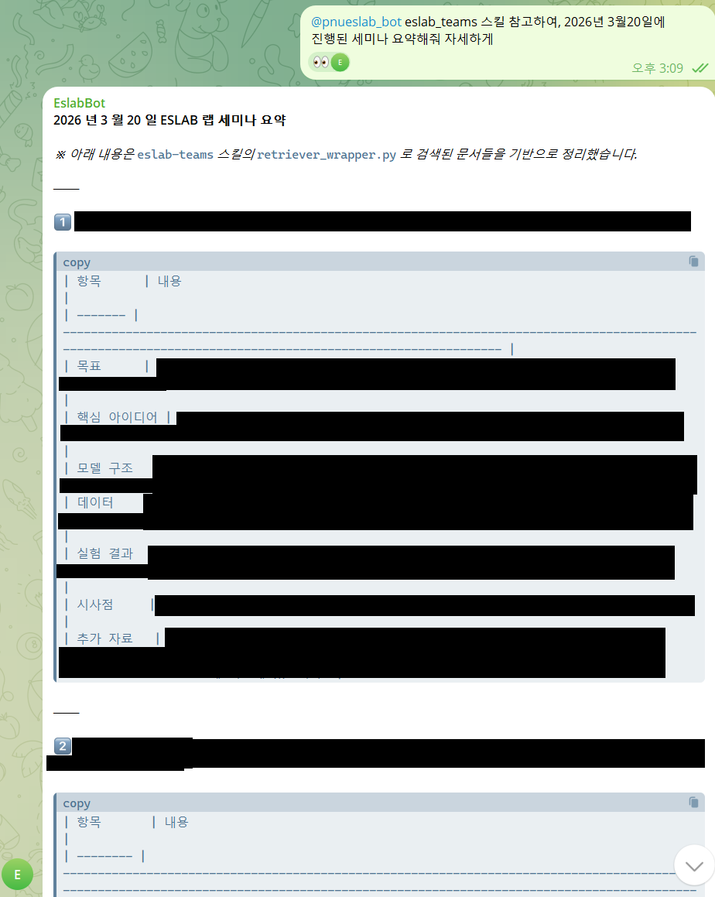
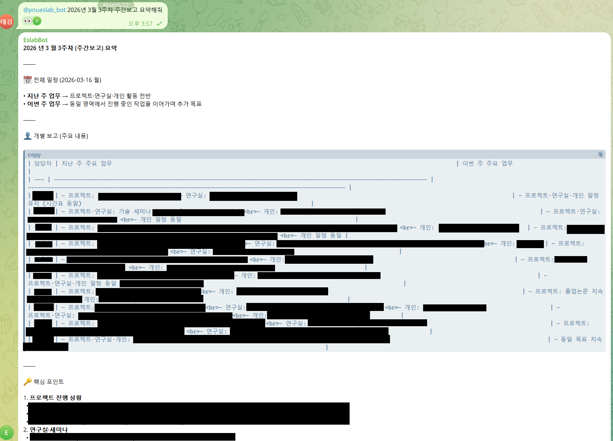

# lab-rag
RAG system for my lab seminar and weekly report

# source code

## pdftotext

`src/pdftotext/pdfconvert.py` : convert Lab seminar pptx to pdf using libreoffice

`src/pdftotext/textconvert.py` : convert Lab seminar pdf and weekly report pdf to text using pdftotext(poppler-utils)

`src/pdftotext/weeklysplit.py` : Split the weekly report text files, which are already divided by month(march 2020 weekly report.txt), into separate files for each week(2nd week march 2020 weekly report.txt,...)

## db_retriever

`src/db_retriever/config.py` : DB config, text file location, embedding model name

`src/db_retriever/db.py` : db connection, creating schema

`src/db_retriever/embed.py` : embedding query and documents with embedding model

`src/db_retriever/ingest.py` : upload the document and embedding vector to db

`src/db_retriever/retriever.py` : retrieve (with filter or vector)

`src/db_retriever/retrieve_wrapper.py` : retrieve function for openclaw

# How to use?
refer the [SKILL.md](https://github.com/minchoCoin/lab-rag/blob/main/SKILL.md)

## file tree
```
.
├── origin
│   ├── Lab seminar
│   │   ├── 2020년 Lab 세미나
│   │   │   └── [20200303_홍길동] Attention is all you need.pptx
│   │   ├── 2020년 교육 세미나
│   │   └── 2020년 8월 졸업논문
│   └── weekly report
│       ├── 2020년 주간보고
│       │   ├── 2020년 8월 주간보고
│       │   │   └── 2020년 8월 3주차 주간보고.one
│       │   └── 2020년 9월 주간보고
│       └── 2021년 주간보고
│
├── pdf
│   ├── Lab seminar
│   │   ├── 2020년 Lab 세미나
│   │   │   └── [20200303_홍길동] Attention is all you need.pdf
│   │   ├── 2020년 교육 세미나
│   │   └── 2020년 8월 졸업논문
│   └── weekly report
│       ├── 2020년 주간보고
│       │   ├── 2020년 8월 주간보고
│       │   │   └── 2020년 8월 3주차 주간보고.pdf
│       │   └── 2020년 9월 주간보고
│       └── 2021년 주간보고
│
├── text
│   ├── Lab seminar
│   │   ├── 2020년 Lab 세미나
│   │   │   └── [20200303_홍길동] Attention is all you need.txt
│   │   ├── 2020년 교육 세미나
│   │   └── 2020년 8월 졸업논문
│   └── weekly report
│       ├── 2020년 주간보고
│       │   ├── 2020년 8월 주간보고
│       │   │   └── 2020년 8월 3주차 주간보고.txt
│       │   └── 2020년 9월 주간보고
│       └── 2021년 주간보고
│
├── pdfconvert
│   ├── pdfconvert.py
│   ├── textconvert.py
│   └── weeklysplit.py
│
├── db_inspector
│   ├── count_documents.py
│   ├── delete_document.py
│   └── list_documents.py
│
├── config.py
├── db.py
├── embed.py
├── ingest.py
├── retriever.py
├── retriever_wrapper.py
└── utils.py

```

## running DB
```
docker run -d \
  --name pgvector-db \
  -e POSTGRES_PASSWORD=yourpasswd\
  -e POSTGRES_DB=labrag \
  -p 5432:5432 \
  pgvector/pgvector:pg16
```

## install package
```bash
conda create -n labrag python==3.12
conda activate labrag
# ROCM 6.4 (Linux only)
pip install torch==2.9.1 torchvision==0.24.1 torchaudio==2.9.1 --index-url https://download.pytorch.org/whl/rocm6.4
# CUDA 12.6
pip install torch==2.9.1 torchvision==0.24.1 torchaudio==2.9.1 --index-url https://download.pytorch.org/whl/cu126
# CUDA 12.8
pip install torch==2.9.1 torchvision==0.24.1 torchaudio==2.9.1 --index-url https://download.pytorch.org/whl/cu128
# CUDA 13.0
pip install torch==2.9.1 torchvision==0.24.1 torchaudio==2.9.1 --index-url https://download.pytorch.org/whl/cu130
# CPU only
pip install torch==2.9.1 torchvision==0.24.1 torchaudio==2.9.1 --index-url https://download.pytorch.org/whl/cpu

pip install -r requirements.txt
```

refer the [pytorch install command](https://pytorch.org/get-started/previous-versions/)

## change config.py
```py
from pathlib import Path

DB_CONFIG = {
    "host": "localhost",
    "port": 5432,
    "dbname": "labrag",
    "user": "postgres",
    "password": "yourpasswd",
}

TEXT_ROOTS = [
    ("text/Lab seminar", "lab_seminar"),
    ("text/weekly report by week", "weekly_report"),
]

SQL_DIR = Path("sql")

EMBED_MODEL_NAME = "BAAI/bge-m3"
CHUNK_SIZE = 1200
CHUNK_OVERLAP = 200
BATCH_SIZE = 16
```

## convert pptx to pdf
```bash
python pdftotext/pdfconvert.py
```

## convert pdf to text
```bash
python pdftotext/textconvert.py
```

## split the weekly report(already merged by month) by week
```bash
python pdftotext/weeklysplit.py
```

## chunking, embedding, uploading the document to DB
```bash
python ingest.py
```

## run local llm and proxy server (local LLM method 1)
We adopt llama.cpp and gpt-oss-120b-Q4_K_M.gguf for local llm(In my case, gpt-oss-120b running on vllm consumed the ~90GB RAM, while gpt-oss-120b running on llama.cpp consumed the ~78GB RAM.)

Thanks to [ZengboJamesWang/Qwen3.5-35B-A3B-openclaw-dgx-spark](https://github.com/ZengboJamesWang/Qwen3.5-35B-A3B-openclaw-dgx-spark), we can connect llama.cpp and openclaw. 

### build llama cpp
```bash
sudo apt-get install -y git cmake build-essential patchelf
# CUDA toolkit must already be installed (comes with DGX Spark OS image)
```
```bash
git clone https://github.com/ggerganov/llama.cpp /opt/llama.cpp
cd /opt/llama.cpp

cmake -B build \
  -DGGML_CUDA=ON \
  -DCMAKE_BUILD_TYPE=Release \
  -DCMAKE_CUDA_ARCHITECTURES=120
cmake --build build --config Release -j $(nproc)
```

### download the model and run

```bash
mkdir -p /opt/llama.cpp/models
pip install huggingface_hub

huggingface-cli download \
  unsloth/gpt-oss-120b-GGUF \
  --include "gpt-oss-120b-Q4_K_M.gguf" \
  --local-dir /opt/llama.cpp/models/
```
```bash
llama-server \
  --model /opt/llama.cpp/models/gpt-oss-120b-Q4_K_M.gguf \
  --ctx-size 131072 \
  --parallel 1 \
  --host 127.0.0.1 \
  --port 8001 \
  -ngl 99 \
  -fa on
```

### run the proxy server
you can download the llama-proxy.py on [this link](https://github.com/ZengboJamesWang/Qwen3.5-35B-A3B-openclaw-dgx-spark/blob/master/proxy/llama-proxy.py)
```
python llama-proxy.py
```

## run local llm(method 2)

thanks to [https://github.com/christopherowen/spark-vllm-mxfp4-docker/](https://github.com/christopherowen/spark-vllm-mxfp4-docker/), we can run gpt-oss with MXFP4 on DGX-SPARK.

```bash
git clone https://github.com/christopherowen/spark-vllm-mxfp4-docker.git
cd spark-vllm-mxfp4-docker
docker build -t vllm-mxfp4-spark .
hf download openai/gpt-oss-120b
docker compose up -d
```

## download and run openclaw
```
curl -fsSL https://openclaw.ai/install.sh | bash
```
```
Model/auth provider: Custom provider
API Base URL: http://127.0.0.1:8000
API Key: custom
Endpoint compatibility: OpenAI-compatible
```

## configure openclaw
```json
//openclaw.json, models > provider
"llamacpp": {
  "baseUrl": "http://127.0.0.1:8000/v1",
  "apiKey": "llamacpp-local",
  "api": "openai-completions",
  "models": [
    {
      "id": "gpt-oss-120b",
      "name": "gpt-oss-120b (local)",
      "reasoning": true,
      "input": ["text"],
      "cost": { "input": 0, "output": 0, "cacheRead": 0, "cacheWrite": 0 },
      "contextWindow": 131072,
      "maxTokens": 32768
    }
  ]
}
```
```json
//openclaw.json, agents > defaults > models
"llamacpp/gpt-oss-120b": {
  "alias": "gpt-oss-120b-custom"
}
```

## configure skills
```
cp SKILL.md ~/.openclaw/workspace/skills/eslab-teams
```

# assets





# 사용 예시

#### 예시 1: 날짜 범위 랩 세미나 조회

이번 주의 날짜를 확인하여, filter를 사용하여 확인

예시 입력

```bash
python retriever_wrapper.py filter \
  --source-type lab_seminar \
  --start-date 2026-03-16 \
  --end-date 2026-03-22 \
  --limit 20
```

#### 예시 2: 랩 세미나 키워드 검색(하이브리드 추천)
```bash
python retriever_wrapper.py hybrid \
  --query "대형 언어 모델 관련 세미나" \
  --source-type lab_seminar \
  --limit 5 \
  --keyword-limit 10 \
  --vector-limit 10
```

#### 예시 3: 특정 날짜 랩세미나 조회
```bash
python retriever_wrapper.py filter \
  --source-type lab_seminar \
  --seminar-date 2026-03-13 \
  --limit 20
```

#### 예시 5: 특정 사람 랩세미나 조회
```bash
python retriever_wrapper.py filter \
  --source-type lab_seminar \
  --speaker "홍길동" \
  --limit 20
```

#### 예시 6: 특정 랩세미나 문서 전체 조회
```bash
python retriever_wrapper.py document --document-id 123
```

#### 예시 7: 이번 주 주간 보고
이번 주가 몇월 몇째주인지 파악하여 year month week를 채워 filter로 검색한다.
```bash
python retrieve_wrapper.py filter \
  --source-type weekly_report \
  --year 2026 \
  --month 3 \
  --week 3 \
  --limit 20
```

#### 예시 8: 특정 주 주간 보고
```bash
python retrieve_wrapper.py filter \
  --source-type weekly_report \
  --year 2020 \
  --month 8 \
  --week 2 \
  --limit 20
```

#### 예시 9: 특정 사람 주간 보고
```bash
python retrieve_wrapper.py filter \
  --source-type weekly_report \
  --speaker "홍길동" \
  --limit 20
```

#### 예시 10: 전체 주간 보고에서 하이브리드 검색
```bash
python retrieve_wrapper.py hybrid \
  --query "STM32" \
  --source-type weekly_report \
  --limit 10 \
  --keyword-limit 10 \
  --vector-limit 10
```

#### 예시 11: 특정 주차 안에서 하이브리드 검색
```bash
python retrieve_wrapper.py hybrid \
  --query "STM32" \
  --source-type weekly_report \
  --year 2020 \
  --month 8 \
  --week 2 \
  --limit 10 \
  --keyword-limit 10 \
  --vector-limit 10
```

#### 예시 11: 특정 월 안에서 하이브리드 검색
```bash
python retrieve_wrapper.py hybrid \
  --query "STM32" \
  --source-type weekly_report \
  --year 2020 \
  --month 8 \
  --limit 10 \
  --keyword-limit 10 \
  --vector-limit 10
```

#### 예시 12: 특정 사람 안에서 하이브리드 검색
```bash
python retrieve_wrapper.py hybrid \
  --query "LLM" \
  --source-type weekly_report \
  --speaker "홍길동" \
  --limit 10 \
  --keyword-limit 10 \
  --vector-limit 10
```

#### 예시 13: 특정 주간 보고 문서 전체 조회
```bash
python retriever_wrapper.py document --document-id 123
```

#### 예시 14: 랩세미나 검색 시 홍길동이 진행한 '기술세미나'만 조회
```bash
python retriever_wrapper.py filter \
  --source-type lab_seminar \
  --speaker "홍길동" \
  --limit 20
  --filepath-keyword 'lab 세미나'
```

#### 예시 14: 랩세미나 검색 시 홍길동이 진행한 '교육세미나'만 조회
```bash
python retriever_wrapper.py filter \
  --source-type lab_seminar \
  --speaker "홍길동" \
  --limit 20
  --filepath-keyword '교육'
```

#### 예시 14: 랩세미나 검색 시 홍길동이 진행한 '졸업 논문 세미나'만 조회
```bash
python retriever_wrapper.py filter \
  --source-type lab_seminar \
  --speaker "홍길동" \
  --limit 20
  --filepath-keyword '졸업'
```
